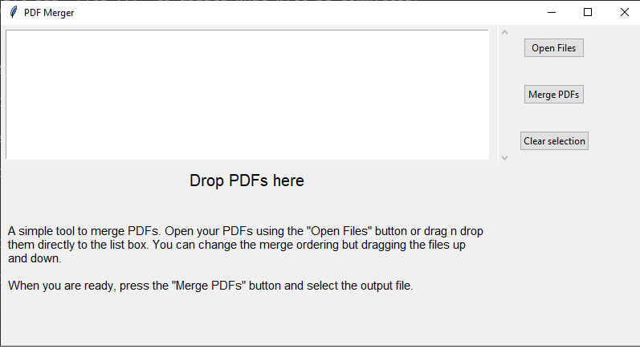

# PDFMerger

A simple tool to merge pdfs files. Download it directly from the [releases](https://github.com/spapas/pdfmerger/releases/latest). 

Please notice that there are two files, a .exe and a .zip file. The .exe file contains everything in the .exe and *will be slower to start* compared to using the pdfmerger.exe from inside the .zip file.

## How it looks



## Why ?

Splitting a PDF to individual files is easy by "printing" it to a file. Merging isn't so easy. There are web-based tools for that but I'd rather avoid transmitting my PDFs on the internet and I don't really want to install a heavy PDF editor only for concatenating a couple of PDFs.

## How

Merging the PDF files is more or less a 4 line script:

```python
from pypdf import PdfWriter


merger = PdfWriter()

for pdf in ['file1.pdf', 'file2.pdf', 'file3.pdf']:
    merger.append(pdf)

merger.write('out.pdf')
merger.close()

```

## Development

This has been build with python 3.10 and tkinter. It uses pyinstall to generate a Windows executable.

See requirements.txt, pdfmerger.bat and workflows/package.yml for more.
